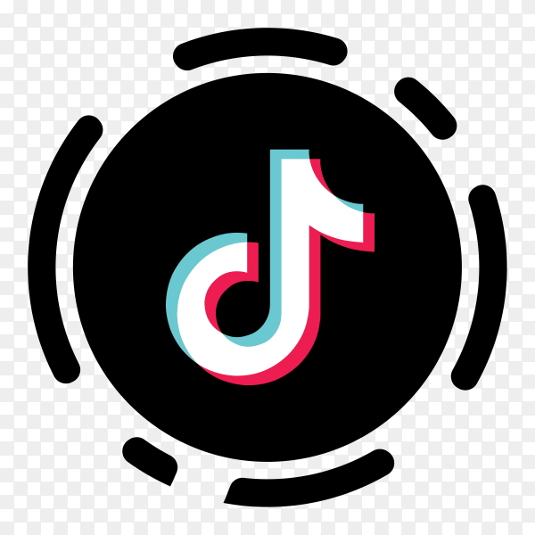

# 🎶 TikTok Engagement Rate Analysis & Prediction 📊

  

#### Welcome to my TikTok Engagement Rate Analysis & Prediction repository! 
Here, you'll find all the resources related to my Capstone project, where I delve into the fascinating world of TikTok videos and user interaction. 💡

---

## Table of Contents

- [Introduction](#introduction)
- [Repository Structure](#repository-structure)
- [Data](#data)
- [Notebooks](#notebooks)
- [Images](#images)
- [Reports](#reports)

## Introduction

TikTok, the ultimate social media sensation, has taken over the hearts of young consumers worldwide with its skyrocketing popularity. We're talking 1.06 billion active users as of 2023, and 83% of them just couldn't resist posting at least one video! 🌟

For content creators, it's like hitting the fame jackpot – a chance to reach an enormous and diverse audience. Viral content, anyone? 🚀 The younger generation is living the dream, becoming influencers, making cash, and gaining a loyal fanbase. It's a one-way ticket to stardom!

But hold up, businesses aren't left behind in this TikTok party! 🎉 For those targeting younger peeps, TikTok is a golden marketing opportunity. The viral potential here is off the charts, outshining other platforms. You can showcase products, join challenges, ride trends, and watch your sales soar, leads generate, and brand shine bright.

Now, here's the real secret sauce: cracking TikTok's video metadata! 😎 Understanding the patterns behind video popularity helps creators and brands boost their impact before hitting that "post" button. Smart decisions on hashtags, music, and upload timing can work wonders for spreading the magic! 🌈

So, come join the TikTok extravaganza! Let's ride the wave of fame, fun, and fabulousness together! 🎶

## Repository Structure

The repository is organized as follows:

- 📁 **Data**: This folder contains both the original data sources and the cleaned dataset that I used in my analysis and modeling.

- 📁 **Notebooks**: Here, you can find all Jupyter notebooks (named step 1 to step 4) that contain my data processing, model training code, and insightful analysis.

- 📁 **Images**: This folder showcases captivating visualizations from my exploratory data analysis.

- 📁 **Reports**: In this directory, you'll find my initial capstone interest, progress standup presentations, final presentation and business report.

## Data

The data folder is split into two subfolders:

- 📊 **Data/Tiktok_dataset**: Contains the original data sources that obtained from https://github.com/datares/TikTok_Famous/tree/main.

- 📊 **Data/Cleaned**: Contains the cleaned dataset ready for analysis, ensuring that the data is in a suitable format for modeling.

## Notebooks

The notebooks folder holds the heart of my project. It is organized sequentially into four notebooks:

1. 📔 **Step 1**: Data Cleaning and Preprocessing
   - I dive into the data, clean it, handle missing values, duplication and outliers, and prepare it for analysis.

2. 📔 **Step 2**: Exploratory Data Analysis (EDA)
   - I conduct exploratory data analysis to uncover patterns and trends in the TikTok engagement data.

3. 📔 **Step 3**: Model Training and Evaluation
   - I embarked on an exciting journey of experimentation by applying five diverse machine learning models to the data. These models included Linear Regression, Random Forest Regressor, Gradient Boosting Regressor, XGBoost Regressor, and LightGBM Regressor. The aim? To assess and compare the performance of each model and uncover the one that shines the brightest! 🌟🚀

4. 📔 **Step 4**: Model Demo
   - The final notebook showcases the model with the absolute best performance.

## Images

🖼️ The image folder houses captivating visualizations that emerged during the Exploratory Data Analysis phase. These visual representations offer a glimpse of the intriguing patterns hidden within the data.

## Reports

🗓️ The Reports directory contains my project journey, from the initial capstone interest to progress standup presentations, and finally, the grand finale of my project - the final presentation and report. 🎤

## Project Highlights

- Thorough data preprocessing steps that handle inappropriate data in multiple situations. 🧹✨
- In-depth data analysis and visualization to understand features related to TikTok user engagement rates. 🔍📈
- Utilization of machine learning algorithms for predicting user engagement rates. 🚀🎯
- Uncover valuable insights and delve into the root cause behind data distribution and patterns. 🔍🌿

---

Let's connect and engage on TikTok data! Feel free to reach out if you have any questions or just want to geek out about data science and machine learning. Happy exploring! 🚀

🎉🎉🎉 🎶🎶🎶
